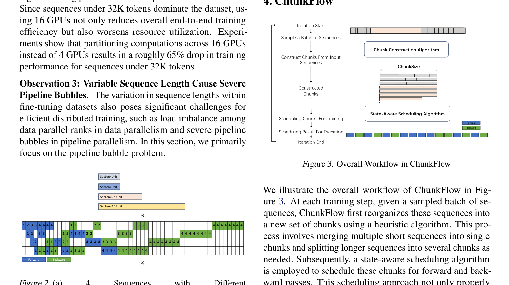
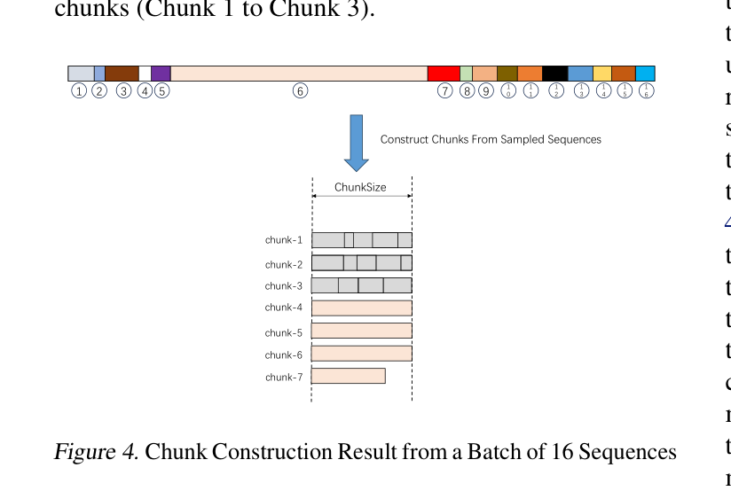
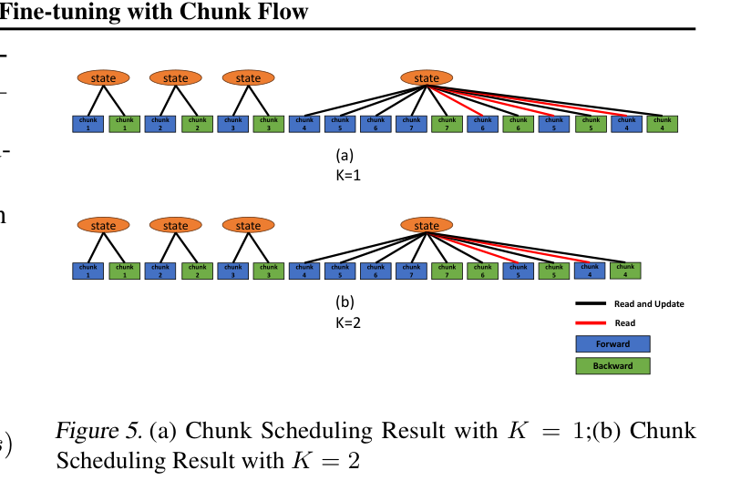
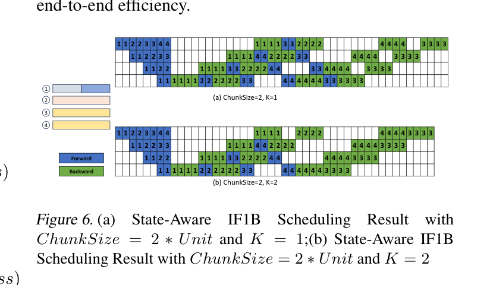
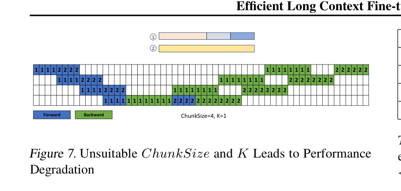
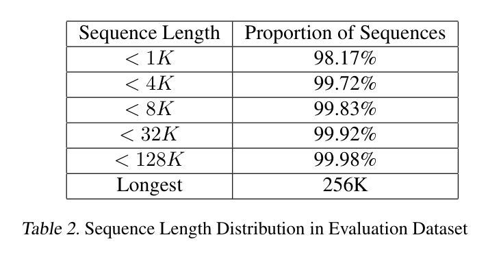
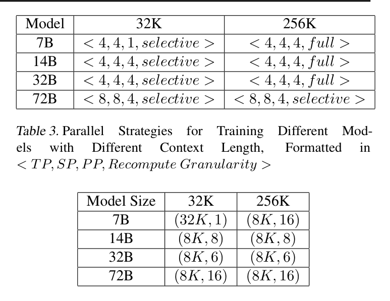
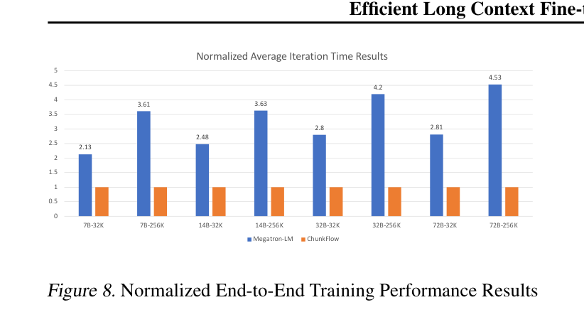
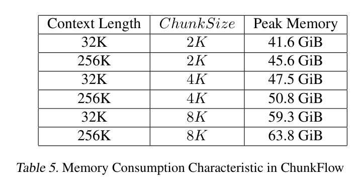
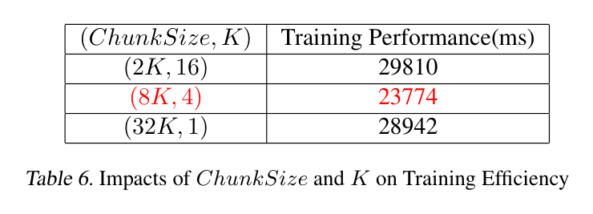

# PDF Element Extractor / PDF元素提取器

<div align="center">


<a href="#" onclick="switchLanguage('en'); return false;" id="en-link" style="color: #007bff; text-decoration: none; margin: 0 10px; font-weight: bold;">English</a> | 
<a href="#" onclick="switchLanguage('zh'); return false;" id="zh-link" style="color: #6c757d; text-decoration: none; margin: 0 10px;">中文</a>

</div>

---

<div id="en-content">

## English

A powerful Python package for automatically identifying and extracting Figure and Table elements from PDF documents.

### Features

- **Automatic Detection**: Identifies Figures and Tables in PDF documents
- **Smart Merging**: Combines related elements with their captions
- **High Quality Output**: Generates clean, merged images
- **Command Line Interface**: Easy-to-use CLI tool
- **Batch Processing**: Process multiple PDFs efficiently

### Installation

```bash
pip install pdf-element-extractor
```

Or install from source:

```bash
git clone https://github.com/shenh10/pdf-element-extractor.git
cd pdf-element-extractor
pip install -e .
```

### Quick Start

```bash
# Basic usage
pdf-element-extractor input.pdf --output results

# Extract only merged images
pdf-element-extractor input.pdf --output results --merged-only

# Process specific pages
pdf-element-extractor input.pdf --output results --pages 1,3,5
```

### Demo Results

The tool successfully extracts Figures and Tables from research papers:

#### Table 1 - Sequence Length Distribution


#### Figure 3 - Model Architecture


#### Figure 4 - Training Process


#### Figure 5 - Performance Comparison


#### Figure 6 - Experimental Results


#### Figure 7 - Detailed Analysis


#### Table 2 - Parallel Strategies


#### Table 3 - Implementation Details


#### Figure 8 - Final Results


#### Table 5 - Memory Consumption


#### Table 6 - Chunk Size Impact


### Usage

```bash
pdf-element-extractor [PDF_FILE] [OPTIONS]

Options:
  --output PATH           Output directory
  --pages PAGES          Specific pages to process (e.g., 1,3,5)
  --merged-only          Generate only merged images
  --no-viz               Skip visualization generation
  --verbose              Enable verbose output
  --help                 Show help message
```

### Output Structure

```
output_directory/
├── merged_images/       # Combined Figure/Table images
├── figure_images/       # Individual Figure elements
├── table_images/        # Individual Table elements
└── Page_*_analysis.png  # Page analysis visualizations
```

</div>

<div id="zh-content" style="display: none;">

## 中文

一个强大的Python包，用于自动识别和提取PDF文档中的图表和表格元素。

### 功能特性

- **自动检测**: 识别PDF文档中的图表和表格
- **智能合并**: 将相关元素与其标题合并
- **高质量输出**: 生成清晰的合并图像
- **命令行界面**: 易于使用的CLI工具
- **批量处理**: 高效处理多个PDF文件

### 安装

```bash
pip install pdf-element-extractor
```

或从源码安装:

```bash
git clone https://github.com/shenh10/pdf-element-extractor.git
cd pdf-element-extractor
pip install -e .
```

### 快速开始

```bash
# 基本用法
pdf-element-extractor input.pdf --output results

# 仅提取合并图像
pdf-element-extractor input.pdf --output results --merged-only

# 处理指定页面
pdf-element-extractor input.pdf --output results --pages 1,3,5
```

### 演示结果

该工具成功从研究论文中提取图表和表格:

#### 表格1 - 序列长度分布


#### 图表3 - 模型架构


#### 图表4 - 训练过程


#### 图表5 - 性能对比


#### 图表6 - 实验结果


#### 图表7 - 详细分析


#### 表格2 - 并行策略


#### 表格3 - 实现细节


#### 图表8 - 最终结果


#### 表格5 - 内存消耗


#### 表格6 - 块大小影响


### 使用方法

```bash
pdf-element-extractor [PDF文件] [选项]

选项:
  --output PATH           输出目录
  --pages PAGES          指定要处理的页面 (例如: 1,3,5)
  --merged-only          仅生成合并图像
  --no-viz               跳过可视化生成
  --verbose              启用详细输出
  --help                 显示帮助信息
```

### 输出结构

```
输出目录/
├── merged_images/       # 合并的图表/表格图像
├── figure_images/       # 单独的图表元素
├── table_images/        # 单独的表格元素
└── Page_*_analysis.png  # 页面分析可视化
```

</div>

---

## License / 许可证

MIT License - see LICENSE file for details. / MIT许可证 - 详情请参阅LICENSE文件。

<script>
function switchLanguage(lang) {
    const enContent = document.getElementById('en-content');
    const zhContent = document.getElementById('zh-content');
    const enLink = document.getElementById('en-link');
    const zhLink = document.getElementById('zh-link');
    
    if (lang === 'en') {
        enContent.style.display = 'block';
        zhContent.style.display = 'none';
        enLink.style.color = '#007bff';
        enLink.style.fontWeight = 'bold';
        zhLink.style.color = '#6c757d';
        zhLink.style.fontWeight = 'normal';
    } else {
        enContent.style.display = 'none';
        zhContent.style.display = 'block';
        enLink.style.color = '#6c757d';
        enLink.style.fontWeight = 'normal';
        zhLink.style.color = '#007bff';
        zhLink.style.fontWeight = 'bold';
    }
}

// Initialize with English
document.addEventListener('DOMContentLoaded', function() {
    switchLanguage('en');
});
</script> 