# PDF Element Extractor

<div align="center">

[](https://www.python.org/)
[](LICENSE)
[](https://pypi.org/project/pdf-element-extractor/)

[English](#english) | [中文](#中文)

</div>

<div align="center">

**A powerful Python package for automatically identifying and extracting Figure and Table elements from PDF documents**

[Installation](#installation) • [Quick Start](#quick-start) • [Features](#features) • [Demo](#demo-results) • [Documentation](#usage)

</div>

---

## English

### Features

- 🔍 **Automatic Detection**: Identifies Figures and Tables in PDF documents
- 🎯 **Smart Merging**: Combines related elements with their captions
- 🎨 **High Quality Output**: Generates clean, merged images
- 🖥️ **Command Line Interface**: Easy-to-use CLI tool
- ⚡ **Batch Processing**: Process multiple PDFs efficiently

### Installation

```bash
pip install pdf-element-extractor
```

Or install from source:

```bash
git clone https://github.com/shenh10/pdf-element-extractor.git
cd pdf-element-extractor
pip install -e .
```

### Quick Start

```bash
# Basic usage
pdf-element-extractor input.pdf --output results

# Extract only merged images
pdf-element-extractor input.pdf --output results --merged-only

# Process specific pages
pdf-element-extractor input.pdf --output results --pages 1,3,5
```

### Demo Results

The tool successfully extracts Figures and Tables from research papers:

#### Figure 1 - Model Architecture
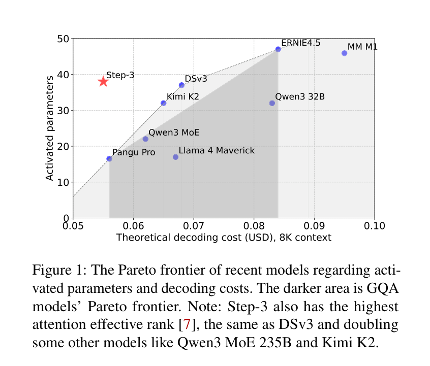

#### Table 1 - Dataset Statistics
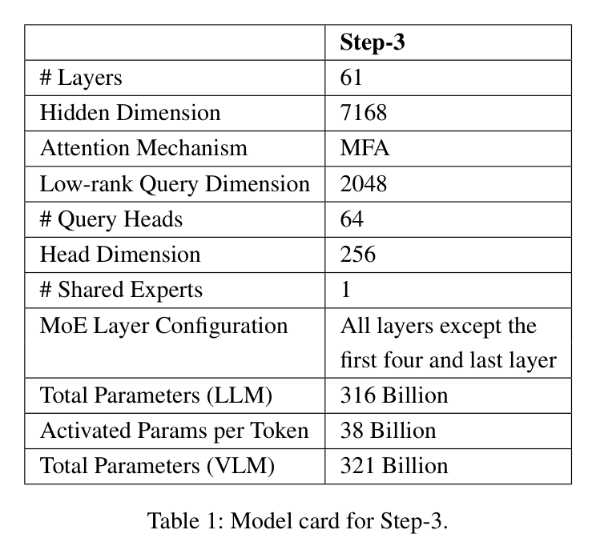

#### Table 3 - Theoretical Computation Analysis
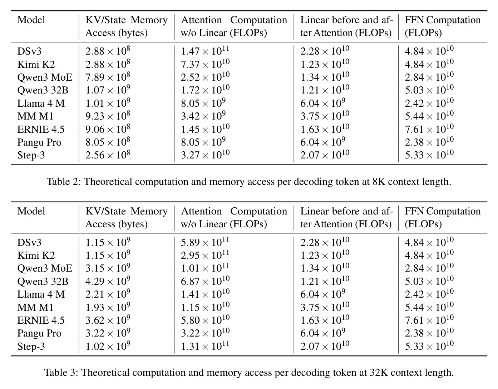

#### Table 4 - Comparison of Acceleration Methods
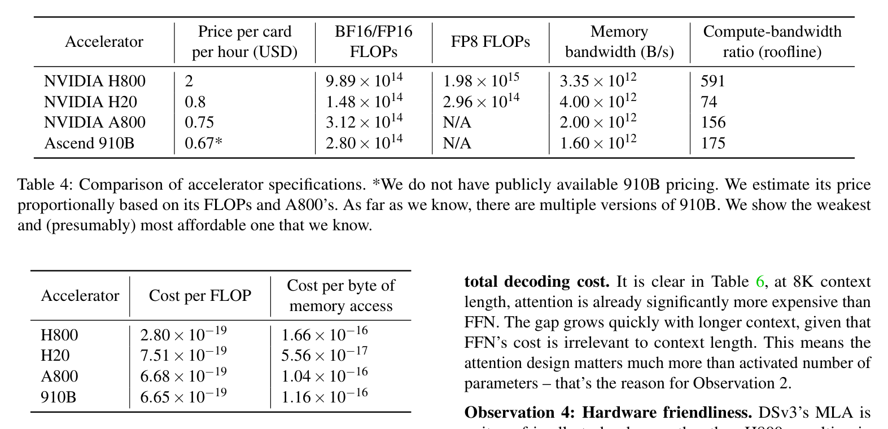

#### Figure 2 - Training Process
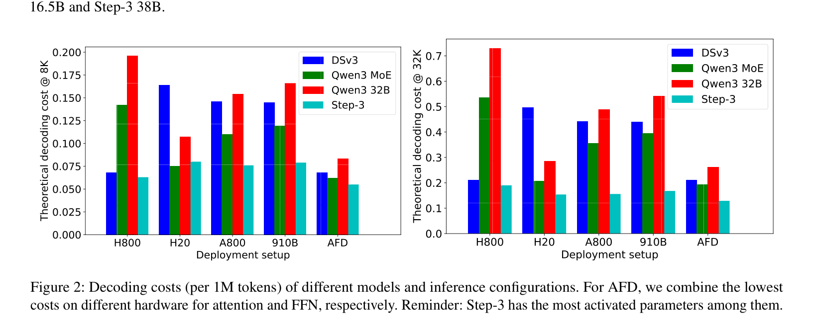

#### Figure 3 - Performance Metrics
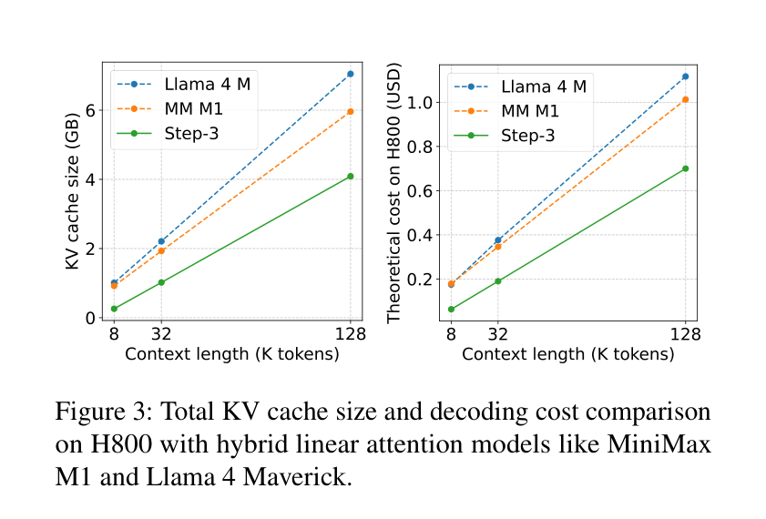

#### Figure 4 - Experimental Results
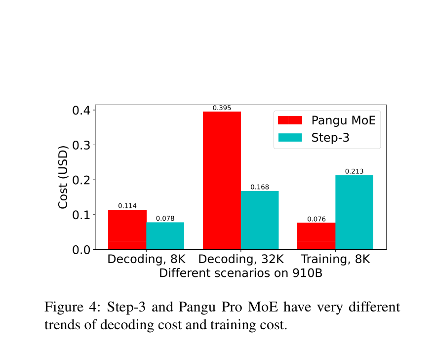

#### Figure 5 - Detailed Analysis
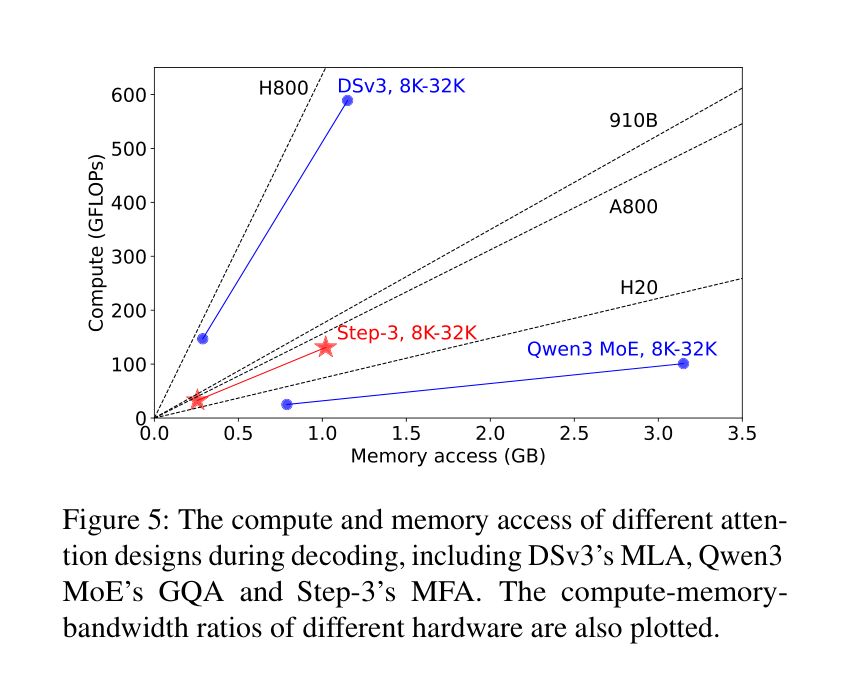

#### Table 7 - Implementation Details
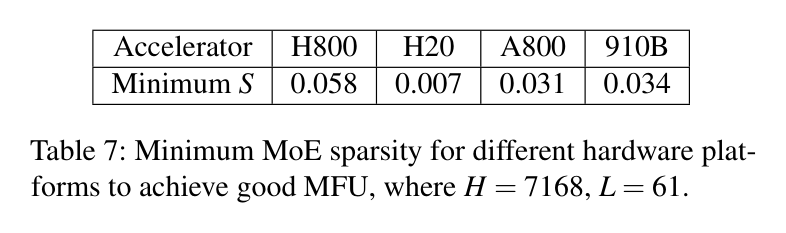

#### Figure 6 - Model Comparison
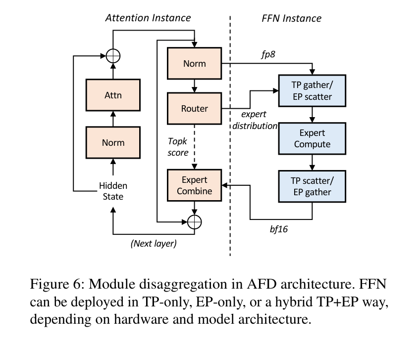

#### Figure 7 - Ablation Study
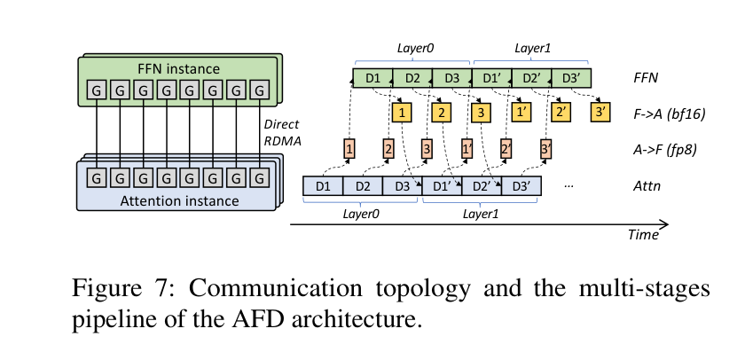

#### Figure 8 - Final Results
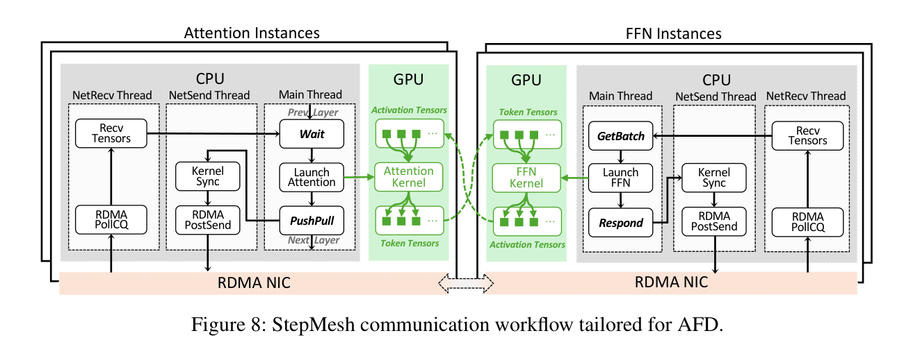

#### Figure 9 - Additional Analysis
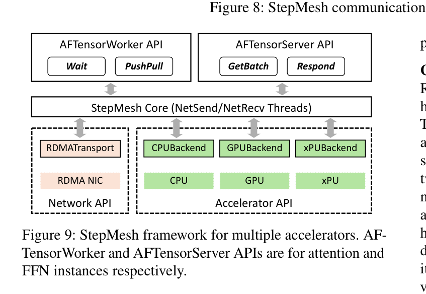

#### Table 8 - Performance Comparison
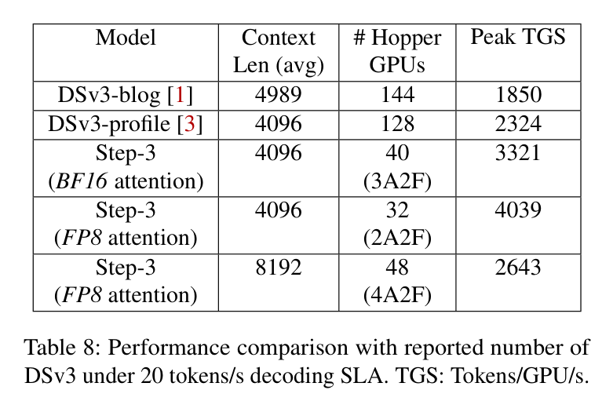

#### Table 9 - Comprehensive Evaluation
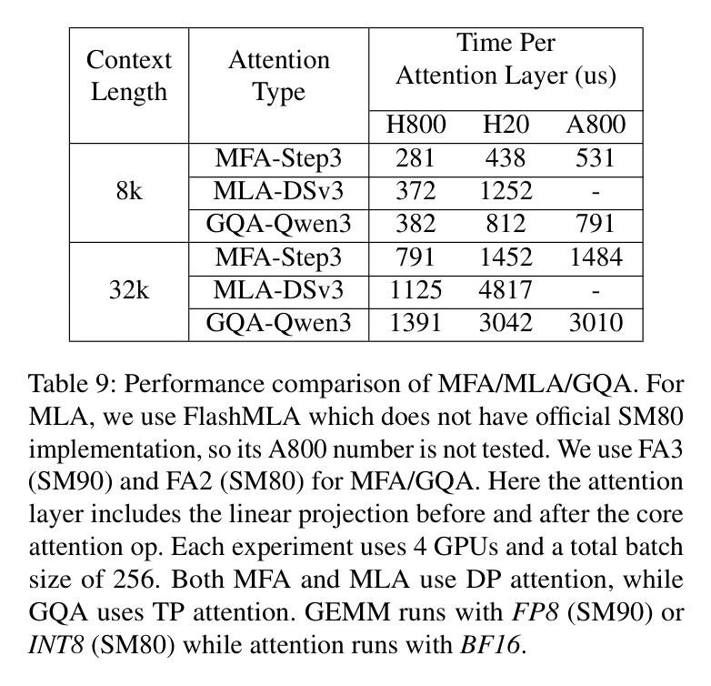

### Usage

```bash
pdf-element-extractor [PDF_FILE] [OPTIONS]

Options:
  --output PATH           Output directory
  --pages PAGES          Specific pages to process (e.g., 1,3,5)
  --merged-only          Generate only merged images
  --no-viz               Skip visualization generation
  --verbose              Enable verbose output
  --help                 Show help message
```

### Output Structure

```
output_directory/
├── merged_images/       # Combined Figure/Table images
├── figure_images/       # Individual Figure elements
├── table_images/        # Individual Table elements
└── Page_*_analysis.png  # Page analysis visualizations
```

---

## 中文

### 功能特性

- 🔍 **自动检测**: 识别PDF文档中的图表和表格
- 🎯 **智能合并**: 将相关元素与其标题合并
- 🎨 **高质量输出**: 生成清晰的合并图像
- 🖥️ **命令行界面**: 易于使用的CLI工具
- ⚡ **批量处理**: 高效处理多个PDF文件

### 安装

```bash
pip install pdf-element-extractor
```

或从源码安装:

```bash
git clone https://github.com/shenh10/pdf-element-extractor.git
cd pdf-element-extractor
pip install -e .
```

### 快速开始

```bash
# 基本用法
pdf-element-extractor input.pdf --output results

# 仅提取合并图像
pdf-element-extractor input.pdf --output results --merged-only

# 处理指定页面
pdf-element-extractor input.pdf --output results --pages 1,3,5
```

### 演示结果

该工具成功从研究论文中提取图表和表格:

#### 图表1 - 模型架构


#### 表格1 - 数据集统计


#### 表格3 - 理论计算分析


#### 表格4 - 加速方法对比


#### 图表2 - 训练过程


#### 图表3 - 性能指标


#### 图表4 - 实验结果


#### 图表5 - 详细分析


#### 表格7 - 实现细节


#### 图表6 - 模型对比


#### 图表7 - 消融研究


#### 图表8 - 最终结果


#### 图表9 - 附加分析


#### 表格8 - 性能对比


#### 表格9 - 综合评估


### 使用方法

```bash
pdf-element-extractor [PDF文件] [选项]

选项:
  --output PATH           输出目录
  --pages PAGES          指定要处理的页面 (例如: 1,3,5)
  --merged-only          仅生成合并图像
  --no-viz               跳过可视化生成
  --verbose              启用详细输出
  --help                 显示帮助信息
```

### 输出结构

```
输出目录/
├── merged_images/       # 合并的图表/表格图像
├── figure_images/       # 单独的图表元素
├── table_images/        # 单独的表格元素
└── Page_*_analysis.png  # 页面分析可视化
```

---

## License

This project is released under the [MIT License](LICENSE). 